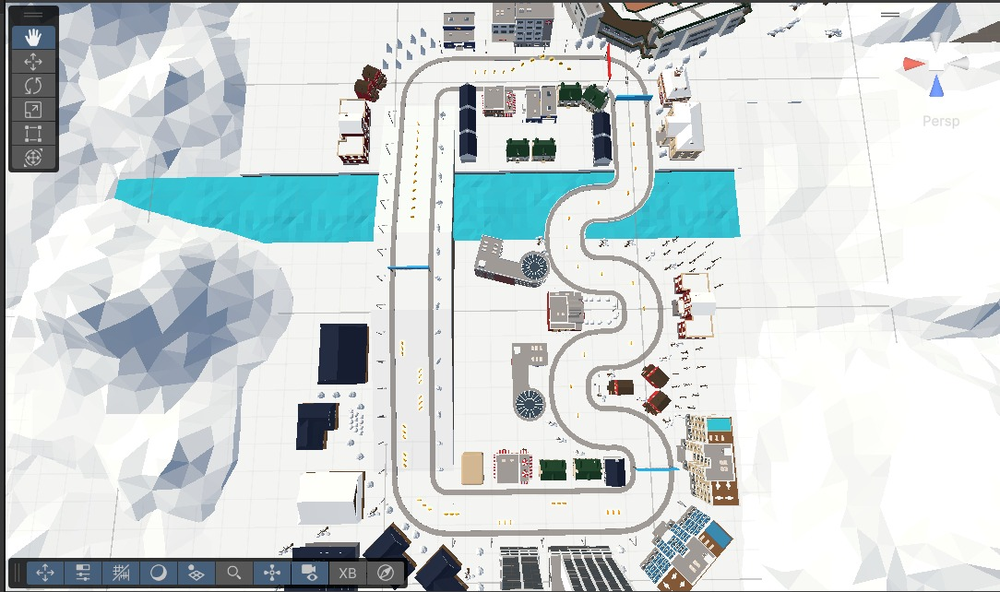
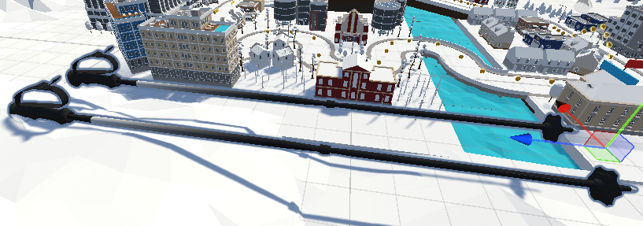
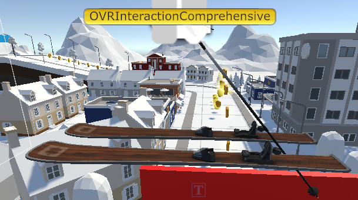
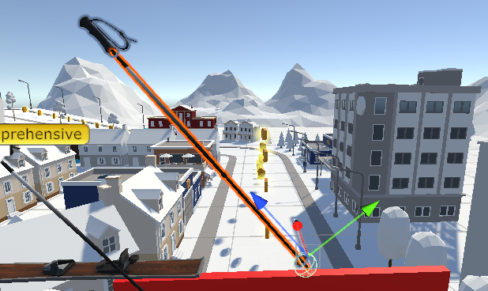
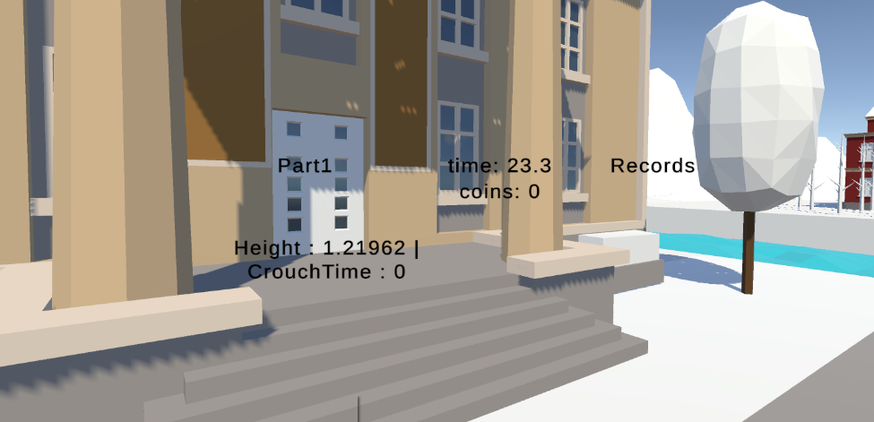
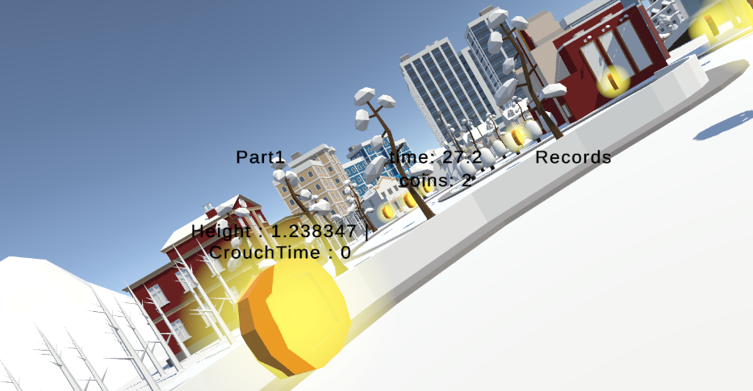

[Back](./)

# Presentation - Locomotion Ideas


We pitched 3 different ways to do locomotion in VR, that were all interesting to think about, however we decided to go for a different idea for the project itself.

# Presentation - Project Locomotion Pitch


We wanted to implement a Ski Locomotion as we thought it would make for an interesting challenge and a fun way to move around in VR.*

# Development process
Our project development process went as follow.
First we searched for assets to be used, and we adapted the terrain textures to make it snowy.

*snow city*

*big ski poles*

Then we added the Meta XR building blocks and we attached our models such that the poles follow the controllers motion in a fitting way.


As a starting point, we first added some colliders to both our terrain and the tip of our ski poles to detect whenever they are in contact.


That way, by setting up the collision layers and tag in Unity, we could have the Unity::GameObject's OnTriggerEnter method be called each time our poles entered the ground. We used that to add some forward momentum to our player object, depending on how they thrust their controller. We wanted them to turn when thrusting only one pole, and thus we kept track of a variable that would increase or decrease depending on which pole was thrusted, and we made our player object turn depending on this variable.
``` cs
[SerializeField, Range(0.0f, 1.0f)] private float turningPerPush = 0.3f;
[SerializeField, Range(0.0f, 1.0f)] private float turningDampening = 0.9f;
private float turningRate = 0.0f;

[SerializeField] float maxTurningAngle = 120f; // degrees per second at full input
[SerializeField] float turnResponsiveness = 1.5f;


void HandleTurning(float turnDirection)
{
    Vector3 flattenedVelocity = rb.linearVelocity;
    flattenedVelocity.y = 0.0f;
    float yVelocity = rb.linearVelocity.y;
    float speed = flattenedVelocity.magnitude;

    if (speed < 0.1f) return;

    float turnAmount =
        turnDirection *
        maxTurningAngle *
        turnResponsiveness *
        Time.fixedDeltaTime;

    Quaternion turnRotation = Quaternion.Euler(0f, turnAmount, 0f);
    rb.MoveRotation(rb.rotation * turnRotation);

    rb.linearVelocity = Vector3.Lerp(
        flattenedVelocity,
        transform.forward * speed,
        0.1f
    );

    rb.linearVelocity = new Vector3(rb.linearVelocity.x, yVelocity, rb.linearVelocity.z);
}
``` 
and here is how we called our HandleTurning method at each frame :
```cs
turningRate *= Mathf.Pow(turningDampening, Time.fixedDeltaTime);
float currentTurningRate = Mathf.Clamp(turningRate, -1.0f, 1.0f);
HandleTurning(currentTurningRate);
``` 

By then we realized it was a bit too hard to control our speed and so we added a way for the user to "brake" (or simulate a snowplow position) by pressing some button on both controller.

```cs
if (leftTriggerValue > 0.8f && rightTriggerValue > 0.8f)
{
    float snowplowDamp = Mathf.Pow(snowplowValue, Time.deltaTime);

    rb.linearVelocity *= snowplowDamp;
    turningRate *= snowplowDamp;
}
```

To implement jumping, we used a threshold variable such that if the coordinates of our headset (in the VR coordinate system) is below it, we start to measure time. When we go above the threshold again, we give the player object some vertical momentum depending on the "crouching" time. To make sure that the user can reach the threshold, we assigned a "reset" button that makes the threshold a bit lower than the current position when pressed.
```cs
if(height > threshold && isCrouched)
{
    float jumpForce = 
        jumpForceBaseFactor * crouchTimeToJumpHeight(crouchTime);
    Vector3 force = jumpForce * Vector3.up;
    rb.AddForce(force, ForceMode.VelocityChange);
    
    isCrouched = false;
    crouchTime = 0.0f;
}
```


*The gui indicates how much time you spent crouching, as well as the current height and threshold*

Finally, we wanted to help the user make sharper turn, and so we made it such that tilting their head makes them turn more. It was quite hard to get it right, as there were multiple solutions to this problem. We settled on a simple one that made our *turn* variable increase or decrease more when the user's head was tilted in the right direction
```cs
turningRate += turningPerPush * (tilted ? sharpMultiplier : 1.0f);
```


*The player tilting their head to take on the zigzag section*


[Link to the video demo](https://www.youtube.com/watch?v=1xrpjvPshhY)

# Evaluation - User Testing

In total, we had the feedback from the two of us and two external users. After trying out the controls, we were all tasked with completing one lap of the circuit as fast as possible while collecting as many coins as possible. At the end, we had to rate several measures out of ten (1 being the lowest, and 10 the highest : the feeling of sickness, the difficulty of the task, the presence and the enjoyment. The results are as follow.

| Time       | % of coins collected | Simulator Sickness | Task Workload | Presence | Enjoyment |
|:-------------|:------------------|:------|:--|:--|:--|
| 2m 11s       | 49% | 2/10 | 4/10 | 4/10 | 6/10 |
| 2m 45s       |  52%  | 1/10 | 4/10 | 6/10 | 5/10 |
| 3m 01s       |  53%  | 4/10 | 5/10 | 6/10 | 8/10 |
| 2m 42s       | 50% | 3/10 | 4/10 | 5/10 | 6/10 |

From this user study, we can conclude that even though this method of locomotion is not the most precise (as the accuracy to pick up the coins barely goes above 50%), it is mostly enjoyable to use, while causing little simulator sickness with a medium sense of presence.

[Back](./)
